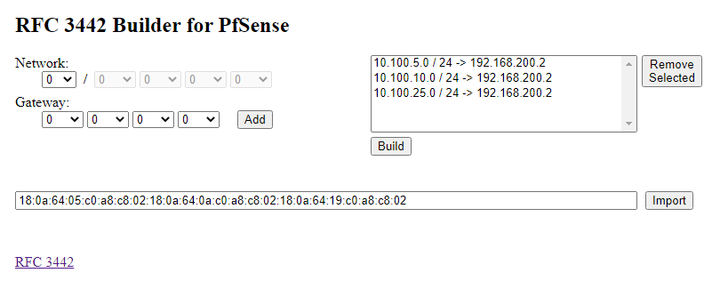

# rfc3442
Calculator to build RFC3442 DHCP Option 121 strings for PfSense and other software that uses the same format

This code was hacked together in the space of 3-4 hours, rather than spending the 10 minutes it would have taken to simply hand calculate the value I needed for my use case.  The calculator did generate the correct values for my scenario, but no warranty or gaurantee that it will work for your use case is given or implied.

